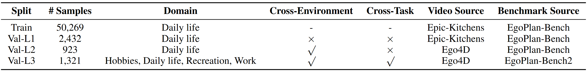

<div align="center">
<h1>
Exploring the Effect of Reinforcement Learning on Video Understanding: 
Insights from SEED-Bench-R1

<a href='https://arxiv.org/pdf/2503.24376'></a> 
<a href='https://huggingface.co/datasets/TencentARC/SEED-Bench-R1'></a>
</h1>


<p align="center">
  
</p>

</div>

## 🚀Introduction

Recent advancements in Chain of Thought (COT) generation have significantly improved the reasoning capabilities of Large Language Models (LLMs), with reinforcement learning (RL) emerging as an effective post-training approach. Multimodal Large Language Models (MLLMs) inherit this reasoning potential but remain underexplored in tasks requiring both perception and logical reasoning. To address this, we introduce SEED-Bench-R1, a benchmark designed to systematically evaluate post-training methods for MLLMs in video understanding. It includes intricate real-world videos and complex everyday planning tasks in the format of multiple-choice questions, requiring sophisticated perception and reasoning. SEED-Bench-R1 assesses generalization through a three-level hierarchy: in-distribution, cross-environment, and cross-environment-task scenarios, equipped with a large-scale training dataset with easily verifiable ground-truth answers. Using Qwen2-VL-Instruct-7B as a base model, we compare RL with supervised fine-tuning (SFT), demonstrating RL's data efficiency and superior performance on both in-distribution and out-of-distribution tasks, even outperforming SFT on general video understanding benchmarks like LongVideoBench. Our detailed analysis reveals that RL enhances visual perception but often produces less logically coherent reasoning chains. We identify key limitations such as inconsistent reasoning and overlooked visual cues, and suggest future improvements in base model reasoning, reward modeling, and RL robustness against noisy signals. 

## 🚩News
- [2025/03/31] We release the datasets of SEED-Bench-R1 (videos will be uploaded within two days) and the training / evaluation codes.


## 📝Data

SEED-Bench-R1 consists of a large-scale training set and a hierarchical three-level validation set for in-distribution, cross-environment, and cross-environment-task evaluations. The datasets can be downloaded from [HuggingFace](). 

Specifically, SEED-Bench-R1 is built on our prior works, reusing the training and validation data from our [EgoPlan-Bench](https://github.com/ChenYi99/EgoPlan), as well as the test data from our [EgoPlan-Bench2](https://github.com/qiulu66/EgoPlan-Bench2). The validation data from EgoPlan-Bench are used for Level-1 (in-distribution) and Level-2 (OOD, cross-environment) evaluation, while the test data from EgoPlan-Bench2 cover more general domains and are used for Level-3 (OOD, cross-environment-task) evaluation.

<p align="center">
  
</p>

Questions from the human-verified validation data are formatted as multiple-choice problems. MLLMs need to select the most reasonable answer from four candidate choices. The primary metric is Accuracy. 

<p align="center">
  
</p>


## 🔥Training Models

> [!NOTE] The training code is modified from [Open-R1-Video](https://github.com/Wang-Xiaodong1899/Open-R1-Video). 
> The training commands below are configured for a node of 8 x A100 (40GB). For different hardware and topologies, you may need to tune the batch size and number of gradient accumulation steps.

### Set up
```
git clone https://github.com/TencentARC/SEED-Bench-R1.git
cd SEED-Bench-R1
conda create -n r1 python=3.10
conda activate r1
pip3 install -e ".[dev]"
pip3 install flash_attn --no-build-isolation
cd qwen-vl-utils
pip install -e .
cd ..

# download data and put in data/
git lfs install
git clone https://huggingface.co/datasets/TencentARC/SEED-Bench-R1

# download the model checkpoint of Qwen2-VL-7B-Instruct
git clone https://huggingface.co/Qwen/Qwen2-VL-7B-Instruct
```


### Post-training Qwen2-VL-7B-Instruct

- To run GRPO on Qwen2-VL-7B with [grpo.sh](scripts/grpo.sh):

```
bash scripts/grpo.sh
```


- To run SFT on Qwen2-VL-7B with [sft.sh](scripts/sft.sh):

```
bash scripts/sft.sh
```


## 🤖Evaluating Models

### Inference

Inference with the post-trained models
```
python infer.py
```


Evaluation results:


## 🙌References & Acknowledgements
We sincerely thank the contributions from the open source community. The related projects are as follows:
- [Open-R1-Video](https://github.com/Wang-Xiaodong1899/Open-R1-Video)
- [EgoPlan](https://github.com/ChenYi99/EgoPlan)
- [EgoPlan-Bench2](https://github.com/qiulu66/EgoPlan-Bench2)
- [open-r1-multimodal](https://github.com/EvolvingLMMs-Lab/open-r1-multimodal)
- [lmm-r1](https://github.com/TideDra/lmm-r1)
- [DeepSeek](https://github.com/deepseek-ai/DeepSeek-R1) 
- [Open-R1](https://github.com/huggingface/open-r1)
- [OpenRLHF](https://github.com/OpenRLHF/OpenRLHF)

## ⭐License
The video samples in SEED-Bench-R1 are collected from [Epic-Kitchens](https://epic-kitchens.github.io/2025) and [Ego4D](https://ego4d-data.org/). Users must follow the related licenses ([Epic-Kitchens](https://creativecommons.org/licenses/by-nc/4.0/) and [Ego4D](https://ego4ddataset.com/ego4d-license/)) to use these video samples for training and validation. SEED-Bench-R1 does not hold the copyright for these videos and the copyright belongs to the original owner of these datasets.


## 📚Citation
If you find our project helpful, hope you can star our repository and cite our paper as follows:

```bibtex
@article{chen2025seedbenchr1,
  title={Exploring the Effect of Reinforcement Learning on Video Understanding: Insights from SEED-Bench-R1},
  author={Chen, Yi and Ge, Yuying and Wang, Rui and Ge, Yixiao and Qiu, Lu and Shan, Ying and Liu, Xihui},
  journal={arXiv preprint arXiv:2503.24376},
  year={2025}
}

@article{chen2023egoplan,
  title={Egoplan-bench: Benchmarking multimodal large language models for human-level planning},
  author={Chen, Yi and Ge, Yuying and Ge, Yixiao and Ding, Mingyu and Li, Bohao and Wang, Rui and Xu, Ruifeng and Shan, Ying and Liu, Xihui},
  journal={arXiv preprint arXiv:2312.06722},
  year={2023}
}

@article{qiu2024egoplan,
  title={Egoplan-bench2: A benchmark for multimodal large language model planning in real-world scenarios},
  author={Qiu, Lu and Ge, Yuying and Chen, Yi and Ge, Yixiao and Shan, Ying and Liu, Xihui},
  journal={arXiv preprint arXiv:2412.04447},
  year={2024}
}
```
